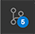

# Jiecheng(Jason) Chen

- [Jiecheng(Jason) Chen](#jiechengjason-chen)
  - [About Me](#about-me)
  - [Lab 1](#lab-1)
    - [Using Git and Github](#using-git-and-github)
    - [Lab 1 Tasks](#lab-1-tasks)


## About Me

My name is Jiecheng, or you can call me Jason. I am a third year **Communication** major, and I am also a **Design** and **Computer Science** minor.


I'm a student with a passion for **front-end development**, **design**, and **visual art**. I have a talent for combining technical skills with a creative eye to produce beautiful and functional websites.

***As a Developer***
- I am familiar with multiple programming languages, including Java, JavaScript, C, C# and C++. As a Computer Science minor at UC San Diego, a free lancing web dev and a video game enthusiast. I have experience with programming, website building and game development.

***As a Designer***
- I put User-Centered-Design principles into practice, by designing websites and interfaces that are useful, usable and enjoyable. Furthermore, my artistic sense helps my designs to be not only user-friendly, but also aesthetically pleasing.

***As an Artist***
- I create art pieces in many different formats. I work as editor, cameraman and director for media art productions. And I also capable at digital illustrations, ceramics, photography and image manipulations.

<br/>

My favorite quote

> *“Art is the elimination of the unnecessary.”* - Pablo Picasso

Learn more about me on my [**Personal Website**](https://jiechengportfolio.site/).

<br/>

## Lab 1

### Using Git and Github
Commit to remote repo by commands, [screenshot](screenshots/command.png)

Core git commands used in Lab 1:
```
git clone https://github.com/JasonARong/CSE110Lab1.git
git branch add-read-me
git checkout add-read-me
git add README.md
apple$ git commit -m "Update readme file"
git push -u origin add-read-me
```

Commit to remote repo by VScode UI, [screenshot](screenshots/ui.png)

Steps: 
1. Navigate to Source Control 
2. Add files to the staging area by pressing the **"+"** icon
3. Type in the commit message in the textbox
4. Press Commit button 
5. Press publicize button

### Lab 1 Tasks
- [x] Part 1. Installing Visual Studio Code and Extensions
- [X] Part 2. (Re)Familiarizing Ourselves with Git
- [ ] Part 3. Using Markdown